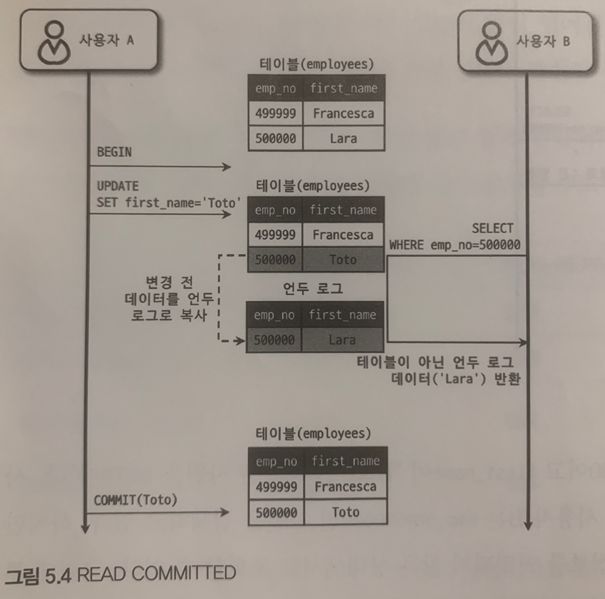

# Mysql 의 격리 수준

## 용어 정리

`DIRTY READ`:  어떤 트랜잭션에서 처리한 작업이 완료되지 않았는데도 다른 트랜잭션에서 볼 수 있다.

`NON-REPEATABLE READ`: 이는 한 트랜잭션 안에서 SELECT 쿼리를 실행 했을 떄 다른 결과를 가져온다.

`PHANTOM READ`

## 격리 수준 정리

|                  | DIRTY READ | NON-REPEATABLE READ | PHANTOM READ          |
|------------------|------------|---------------------|-----------------------|
| READ UNCOMMITTED | 발생         | 발생                  | 발생                    |
| READ COMMITTED   | 없음         | 발생                  | 발생                    |
| REPEATABLE READ  | 없음         | 없음                  | 발생 <br/> (InnoDB는 없음) |
| SERIALIZABLE     | 없음         | 없음                  | 없음                    |

## READ UNCOMMITTED

- `DIRTY READ` 가 허용되는 격리 수준


#### first_name 이 'Lara' 인 레코드는 아직 commit 이 되기전인데, 사용자 B 가 조회를 해버렸다.

-> 아직 commit 되지 않은 정보를 조회해버렸다..

### 문제점 및 주의사항

- 'Lara' 레코드가 commit 이 정상적으로 완료되지 않아 롤백되어 버린다면
- 사용자 B는 잘못된 'Lara' 를 가지고 프로세스를 처리할 것이다.

## READ COMMITTED

- 어떤 트랜잭션에서 데이터를 변경했더라도 COMMIT이 완료된 데이터만 다른 트랜잭션에서 조회할 수 있는 격리 수준



#### 사용자 B는 first_name 이 'Toto' 를 조회했지만, 'Toto' 로 변경한 트랜잭션이 아직 끝나지 않아 'Lara' 를 조회한다.

### 문제점 및 주의사항

`NON-REPEATABLE READ` 라는 부정합 문제가 있다.


#### 사용자 B가 한 트랜잭션에서 초반에 조회한 'Toto' 는 아직 트랜잭션이 끝나지 않아 조회가 불가능했지만, 나중에 조회한 경우는 트랜잭션이 끝나 조회가 된다.

이는 한 트랜잭션 안에서 SELECT 쿼리를 실행 했을 떄는 항상 같은 결과를 가져와야 한다는 `REPEATABLE READ` 정합성에 어긋난다. 이렇게 될 경우, 결과값을 예측하기 어려워진다.

### TX 내에서 SELECT 문과 TX 가 없는 SELECT 문장의 차이

- TX 가 `REPEATABLE READ` 격리 수준 이상일 경우에는 항상 같은 SELECT 결과를 반환
- 그 외에는 `NON-REPEATABLE READ` 가 발생

## REPEATABLE READ

- Mysql 에서 기본적으로 사용되는 격리 수준
- MVCC 를 위해 언두 영역에 백업된 이전 데이터를 이용해 동일 트랜잭션 내에서는 동일한 결과를 보여준다.

```
MVCC : InnoDB 스토리지 엔진은 트랜잭션이 ROLLBACK될 가능성에 대비해 변경되기 전 레코드를 언두(Undo) 공간에
백업해두고 실제 레코드값을 변경한다.

언두 공간이 커지면 DB 엔진의 속도가 느려질 수 있으니 주의하자.
```


#### 트랜잭션안에서 해당 트랜잭션 번호보다 가장 가깝게 작은 데이터를 참조한다.

### 문제점 및 주의사항


#### SELECT FOR UPDATE 의 초반과 후반의 결과가 다르다.

`SELECT FOR UPDATE` 와  `SELECT LOCK IN SHARE MODE` 로 조회되는 레코드는 언두 영역의 변경 전 데이터를 가져오는 것이 아니라 연재 레코드의 값을 가져오게 된다.

```
SELECT FOR UPDATE 

가장 먼저 LOCK을 획득한 SESSION의 SELECT 된 ROW들이 UPDATE 쿼리후
COMMIT 되기 이전까지 다른 SESSION들은 해당 ROW들을 수정하지 못하도록 하는 기능입니다.

SELECT LOCK IN SHARE MODE
트랜잭션이 끝날 때까지 SELECT를 한 Row 값이 변경되지 않는 것을 보장한다.
해당 Row를 수정하려는 쿼리는 잠김 상태가 되어 트랜잭션이 끝날 때까지 대기하게 되고, 
조회 쿼리는 여러 세션이 동시에 수행하는 것이 가능하다.

이는 트랜잭션이 끝나기 전까지만 유효하므로 auto_commit을 꺼야 한다.

```

## SERIALIZABLE

- 한 트랜잭션에서 읽고 쓰는 레코드를 다른 트랜잭션에서는 절대 접근할 수 없는 것
- 읽기 마저 공유 잠금(읽기 잠금)을 획득해야만 한다.

```
InnoDB 스토리지 엔진에서는 `SELECT FOR UPDATE` 와  `SELECT LOCK IN SHARE` 을 제외한 쿼리에 대해서는 
갭 락과 넥스트 키 락 덕분에 REPETABLE READ 격리 수준에서도 이미 "PHANTOM READ" 가 발생하지 않는다.
따라서 굳이 SERIALIZABLE을 사용할 필요성은 없어 보인다. 
```
